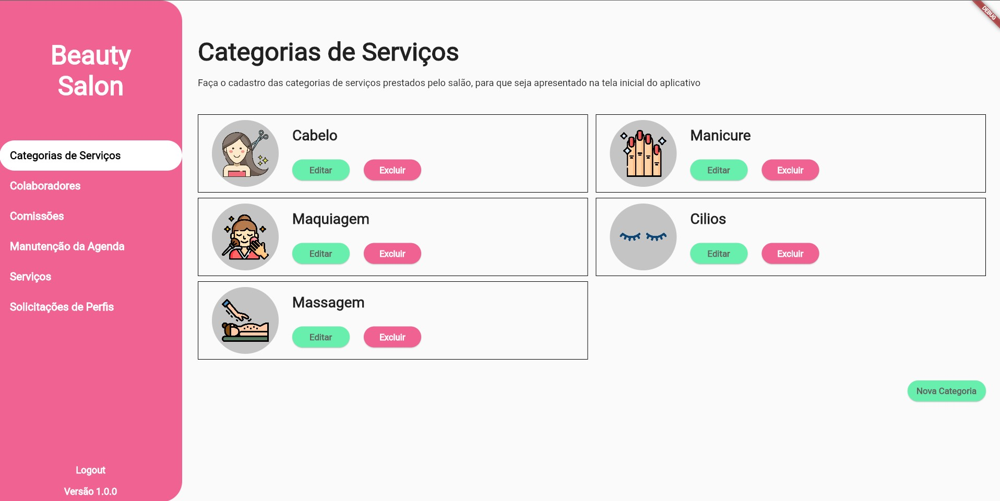
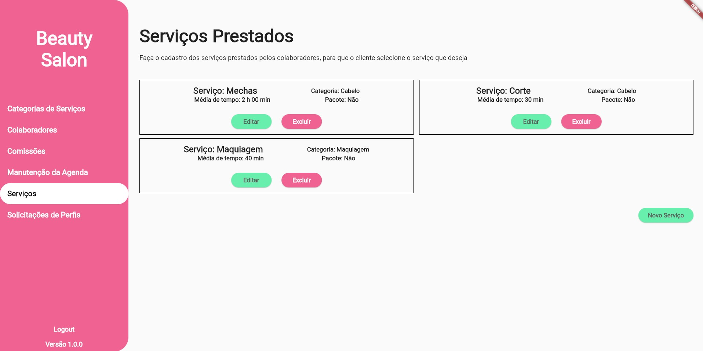
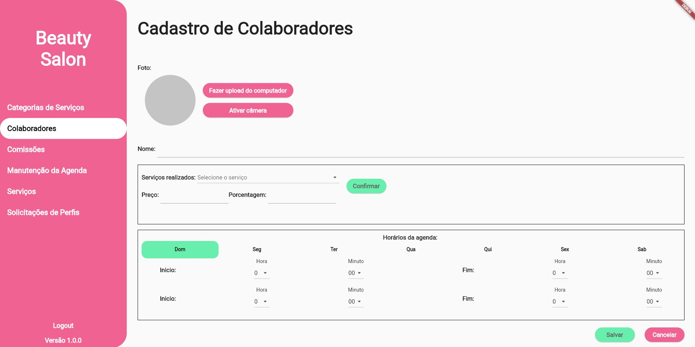

# Beauty Salon Appointment Web
Este projeto é uma aplicação web para manutenção de um salão de beleza.

#

#

## Tecnologias usadas
- Dart, Flutter
- Bloc
- Modular
- Hasura
- Clean Arch
- Cloudinary
- Responsividade

## Como usar a aplicação
A aplicação web contém uma tela para cadastro e manutenção de categorias de serviços.

Após a criação das categorias é possivel cadastrar ou editar os serviços que serão elaborados pelos colaboradores do salão.

Quando tiver os serviços cadastrados é possivel cadastrar o colaborador com quais serviços ele presta e quais os horários disponíveis.

Outras funcionalidades a ser implementadas...

## Prints de algumas telas

